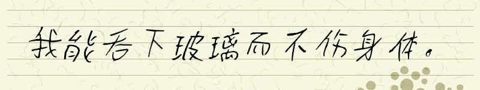
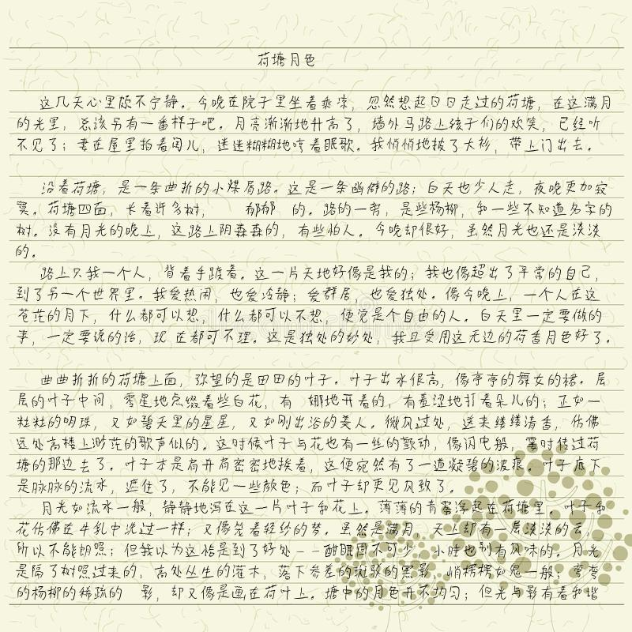
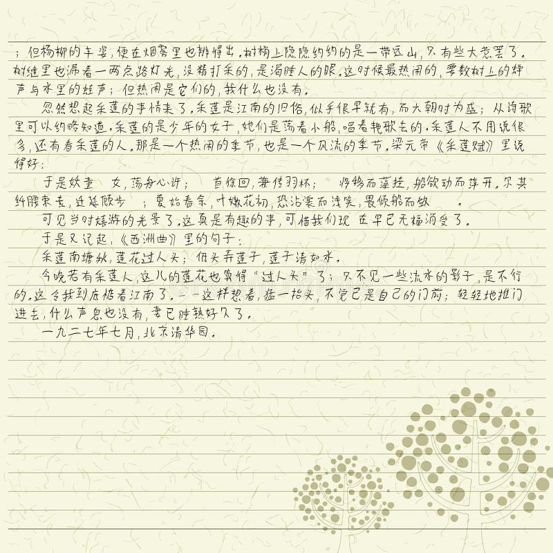

# *PyLf*
[License](./LICENSE) |
[Release Notes](./NEWS.md)

  
*PyLf*是一个轻量级模仿中文手写的*Python*库。其通过在处理过程中大量引入随机性来模仿汉字书写。　 

## Installation
由于*PyLf*的依赖项[*Pillow*](https://python-pillow.org/)会与[*PIL*](http://www.pythonware.com/products/pil/)发生冲突，
如若您已安装[*PIL*](http://www.pythonware.com/products/pil/)，请先**手动卸载**：

    pip uninstall PIL

此外如若您并未安装[*setuptools*](https://pypi.python.org/pypi/setuptools),请先**手动安装**：

    pip install setuptools

安装*PyLf*：

    pip install pylf

## Walk through

    from PIL import Image, ImageFont
    from pylf import handwrite
    
    def main():
        # 设置模板的参数
        template = {
            # 选择背景图片（图片的大小应大于‘box’所限定的范围）
            'background': Image.open("./something.png"),  
            # 限定“手写”的范围的左、上、右、下边界的坐标（以左上角为坐标原点）
            'box': (0, 0, 100, 100),
            # 选择字体
            'font': ImageFont.truetype("./something.ttf"),  
            # 平均字体大小
            'font_size': 10,
            # 绝对值越大字体大小的方差越大  
            'font_size_sigma': 0.1,
            # 行间距
            'line_spacing': 15,
            # 绝对值越大行间距大小的方差越大  
            'line_spacing_sigma': 0.1,
            # 绝对值越大字间距大小的方差越大  
            'word_spacing_sigma': 0.1,
        }
        # 需要“手写”的文本
        text = """我能吞下玻璃而不伤身体。"""
        # 开始“手写”
        images = handwrite(text, template)
        # 显示每一张生成的图片
        for image in images:
            image.show()

    if __name__ == '__main__':
        main()

## For *Windows* users
* [*Windows*用户必读](./docs/Windows用户必读.md)

## Examples
* **“我能吞下玻璃而不伤身体。”**  
示例代码：[/examples/i_can_eat_glass.py](./examples/i_can_eat_glass.py)  
  
* **《荷塘月色》**  
示例代码：[/examples/hetangyuese.py](./examples/hetangyuese.py)  
（注：该图片中之所以缺少个别字，是因为所使用生成该图片的字体本身缺少这些字。）
  
  
 