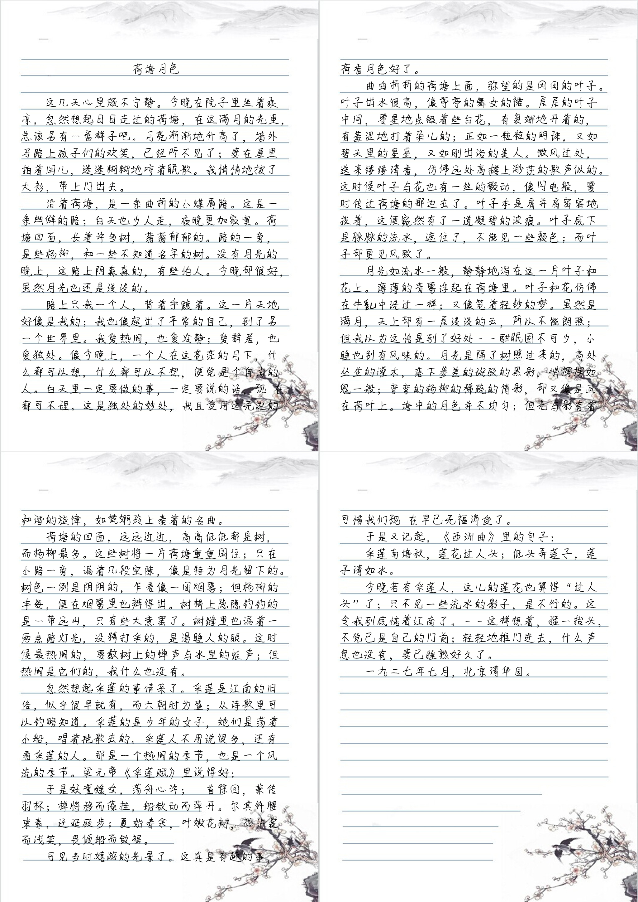

# PyLf
[](https://pypi.python.org/pypi/pylf)
[](https://pypi.python.org/pypi/pylf)
[](https://pypi.python.org/pypi/pylf)
[](https://gitter.im/Python-PyLf/PyLf)

[API Reference](docs/API-Reference.md) |
[Release Notes](NEWS.md) |
[Contributing](docs/CONTRIBUTING.md)


PyLf是一个轻量级模仿中文手写的Python库。其通过在处理过程中大量引入随机性来模仿汉字书写。


## Installation
由于PyLf的依赖项[Pillow][Pillow-homepage]会与[PIL][PIL-homepage]发生冲突，因此如若您已安装[PIL][PIL-homepage]，请先**手动卸载**：
```commandline
pip uninstall PIL
```
此外如若您并未安装[setuptools][setuptools-homepage],请先**手动安装**：
```commandline
pip install setuptools
```
安装PyLf：
```commandline
pip install pylf
```


## Quickstart
```python
from PIL import Image, ImageFont
from pylf import handwrite
from multiprocessing import freeze_support  # 非Windows用户可删除此行


def main():
    template = dict(
        background=Image.new(mode='RGB', size=(800, 1000), color='rgb(255, 255, 255)'),
        box=(100, 200, 800 - 100, 1000 - 200),  # 设置在背景图上的手写区域
        font=ImageFont.truetype("YOUR FONT PATH"),  # 填入您所使用字体文件的路径
        font_size=50,
    )
    text = "我能吞下玻璃而不伤身体。"
    images = handwrite(text, template)
    for image in images:
        image.show()


if __name__ == '__main__':
    freeze_support()  # 非Windows用户可删除此行
    main()
    
```
如以上代码所示，函数`pylf.handwrite`是整个PyLf库的核心。而模板`template`则是本库的一个重要概念。模板包含着在手写模仿过程中所需的背景、排版
设置、字体、随机性强度等参数。这些参数通常因背景图和用户书写习惯的不同而不同。有关`pylf.handwrite`和`template`的更多信息请参阅
[API Reference](docs/API-Reference.md)。一般情况下，在第一次使用某个背景时，您需要根据自己的手写特征创建特定的模板（往往需要经历不断的调
试）。

另外，请您在更新PyLf后及时参阅[Release Notes](NEWS.md)，以了解新版本的变化，特别是在主版本更新的时候（其中往往蕴含着不后向兼容的改动）。


# Features
|                         特性                        |               相关参数                                  |              
| :------------------------------------------------- | :----------------------------------------------------- |
| 设置背景                                            | background                                              |
| 设置字体及其大小、颜色                                | font, font_size, color                                  |
| 设置手写区域、行间距、字间距                           | box, line_spacing, word_spacing                         |
| 调节排版随机化的强弱                                  | font_size_sigma, line_spacing_sigma, word_spacing_sigma |
| 调节页面随机扰动的强弱                                 | alpha                                                  |
| 设置在行末不换行的字符集（如：'。', '》', ')', ']'）     | is_end_char                                             |
| 设置在排版时只占其宽度一半的字符集（如：'，', '。', '！'） | is_half_char                                            |
| 抗锯齿                                              | anti_aliasing                                           |
| 多线程加速                                           | worker                                                  |
| 周期性模板                                           | template2（详情：pylf.handwrite2）                       |


## Examples
**注**：以下某些图片中之所以缺少个别字，是因为所使用生成该图片的字体本身缺少这些字。

* __《荷塘月色》__ <br>

示例代码：[article.py](examples/article.py)




* __《从百草园到三味书屋》__ <br>

示例代码：[even_odd.py](examples/even_odd.py)


# More
* [Windows用户需知](docs/more/Windows用户需知.md)


[PIL-homepage]: http://www.pythonware.com/products/pil/
[Pillow-homepage]: https://python-pillow.org/
[setuptools-homepage]: https://pypi.python.org/pypi/setuptools
