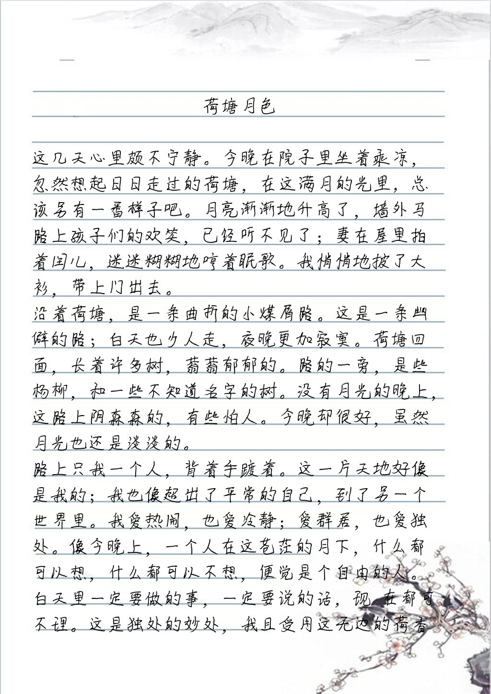
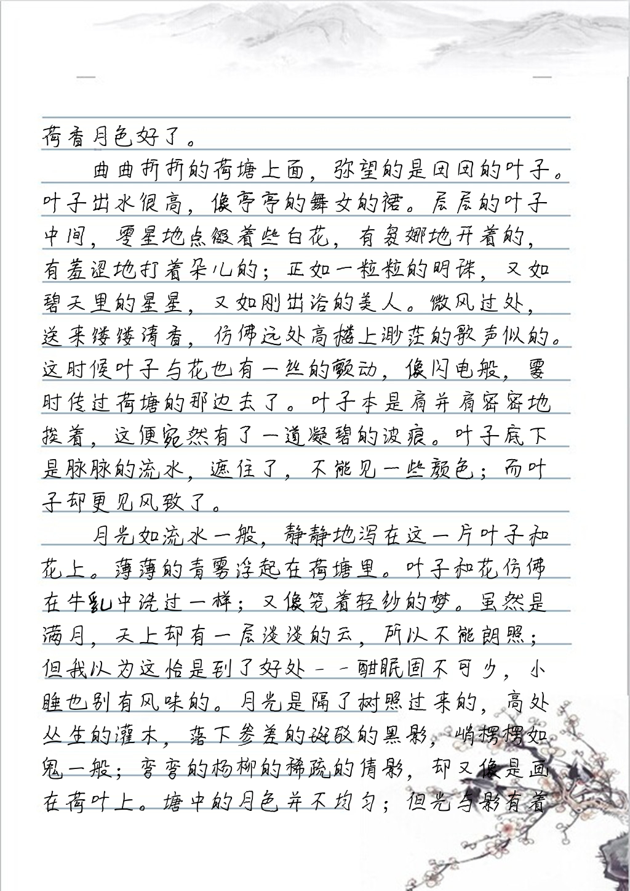
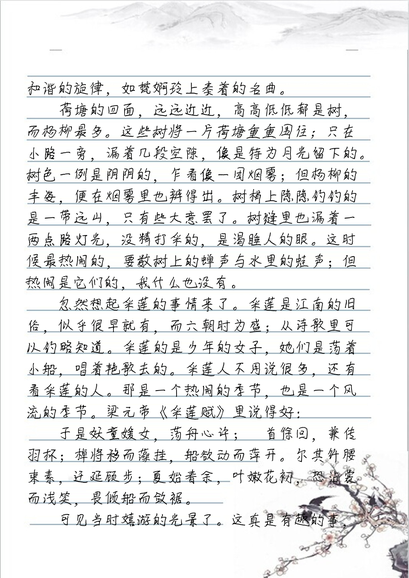
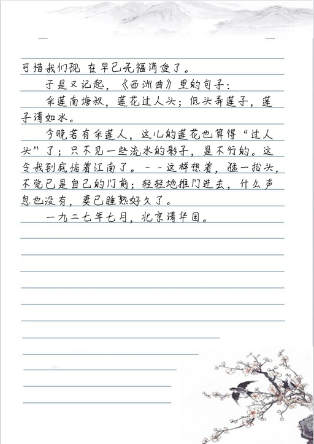

# *PyLf*
[License](LICENSE) |
[Installation](docs/Installation.md) |
[API Reference](docs/API-Reference.md) |
[Release Notes](NEWS.md)

*PyLf*是一个轻量级模仿中文手写的*Python*库，其通过在处理过程中大量引入随机性来模仿汉字书写。

## Walk through

    from PIL import Image, ImageFont
    from pylf import handwrite
    from multiprocessing import freeze_support  # 非Windows用户可删除此行
    
    
    def main():
        # 设置模板的参数
        template = dict(
            # 设置背景图片（图片的大小应大于‘box’所限定的范围）
            background=Image.new(mode='RGB', size=(800, 1000), color='rgb(255, 255, 255)'),
            # 限定“手写”的范围的左、上、右、下边界的坐标（以左上角为坐标原点）
            box=(100, 200, 700, 800),
            # 设置字体
            font=ImageFont.truetype("./something.ttf"),
            font_size=50,
        )
        text = "我能吞下玻璃而不伤身体。"
        images = handwrite(text, template)
        for image in images:
            image.show()
    
    
    if __name__ == '__main__':
        freeze_support()  # 非Windows用户可删除此行
        main()

## Examples

* __“我能吞下玻璃而不伤身体。”__  
示例代码：[examples/motto.py](examples/motto.py)  
  
* __《荷塘月色》__  
示例代码：[examples/article.py](examples/article.py)  
（**注**：该图片中之所以缺少个别字，是因为所使用生成该图片的字体本身缺少这些字。）
  
  
  
  
 
 ## Contributing
 
 * [code of conduct](CODE_OF_CONDUCT.md)
 