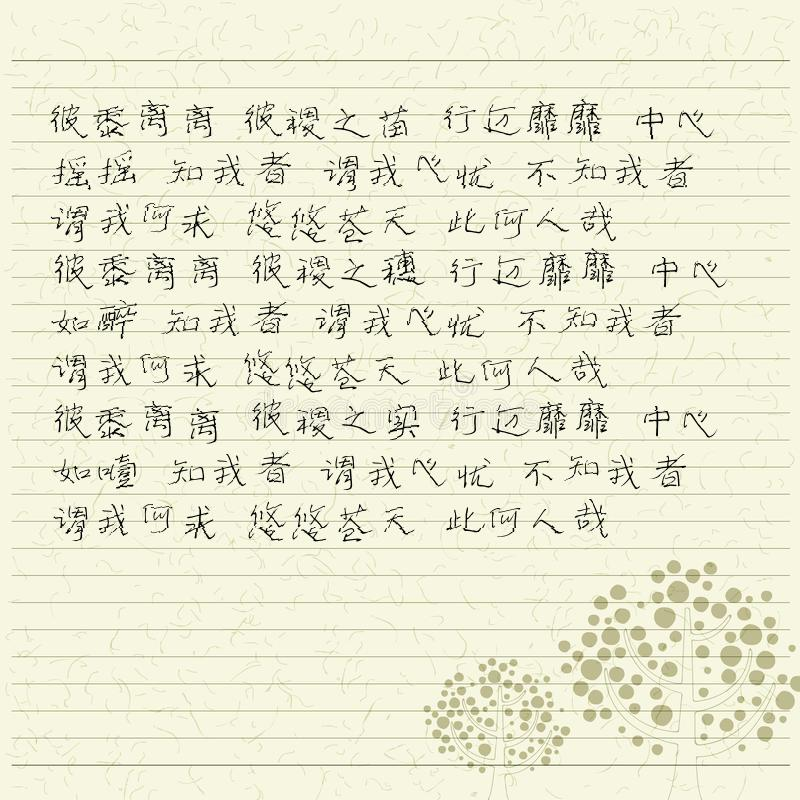

# PyLf
  
PyLf is a lightweight and fast Python library for simulating Chinese handwriting. It introduces a great deal of 
randomness in the process of Chinese handwriting to simulate the uncertainty of glyphs written by human beings.
## For Windows users
* [Windows用户必读！](https://github.com/Gsllchb/PyLf/wiki/Windows%E7%94%A8%E6%88%B7%E5%BF%85%E8%AF%BB%EF%BC%81)
## Installation
由于PyLf在[Pillow](https://python-pillow.org/)之上进行开发，故PyLf在安装过程中会自动安装[Pillow](https://python-pillow.org/)（如
若您的电脑尚未安装此库的话）。但是，由于[Pillow](https://python-pillow.org/)会与[PIL](http://www.pythonware.com/products/pil/)发
生冲突，所以您要是已经安装[PIL](http://www.pythonware.com/products/pil/)，请先**手动卸载**
[PIL](http://www.pythonware.com/products/pil/)。安装PyLf:

    pip install pylf

## Walk through

    from PIL import Image, ImageFont
    from pylf import handwrite
    # 设置模板的参数
    template = {
        # 选择背景图片（图片的大小应大于‘box’所限定的范围）
        'background': Image.open("./something.png"),  
        # 限定“手写”的范围的左、上、右、下边界的坐标（以左上角为坐标原点）
        'box': (0, 0, 1000, 1000),
        # RGB（取值0~255）
        'color': (0, 0, 0),  
        # 选择字体
        'font': ImageFont.truetype("./something.ttf"),  
        # 平均字体大小
        'font_size': 10,
        # 绝对值越大字体大小的随机性越强  
        'font_size_sigma': 0.1,
        # 行间距
        'line_spacing': 15,
        # 绝对值越大行间距大小的随机性越强  
        'line_spacing_sigma': 0.1,
        # 字间距
        'word_spacing': 10,
        # 绝对值越大字间距大小的随机性越强  
        'word_spacing_sigma': 0.1,
        # 判断一个字符是否仅占用正常水平位置的一半
        'is_half_char': lambda c: c.isalpha() or c.isdigit(),
        # 判断一个字符是否不能放在写在行首
        'is_end_char': lambda c: c in ('!', '.', '?')
    }
    # 读取需要“手写”的文本
    with open("something.txt") as f:
        text = f.read()
    # 开始“手写”
    images = handwrite(text, template)
    # 显示每一张生成的图片
    for image in images:
        image.show()
    

## Demo

