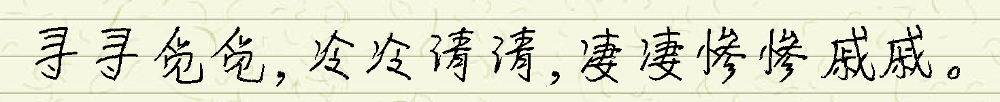

# Handright
___A lightweight Python library for simulating Chinese handwriting___

[][pypi]
[][pypi]
[][license]


[Tutorial][tutorial] |
[Release Notes][release-notes] |
[Contributing][contributing]



## Vision
Reveal the nature of Chinese handwriting and use it to implement beautiful, simple and easy-to-use interfaces.

## Algorithm
首先，在水平位置、竖直位置和字体大小三个自由度上，对每个字的整体做随机扰动。随后，在水平位置、竖直位置和旋转角度三个自由度上，对每个字的每个笔画做随机扰动。

## Installation
```console
pip install handright
```

## Quick Start
```python
# coding: utf-8
from PIL import Image, ImageFont

from handright import Template, handwrite

text = "我能吞下玻璃而不伤身体。"
template = Template(
    background=Image.new(mode="1", size=(1024, 2048), color=1),
    font=ImageFont.truetype("path/to/my/font.ttf", size=100),
)
images = handwrite(text, template)
for im in images:
    assert isinstance(im, Image.Image)
    im.show()

```
更多信息请参阅[Tutorial][tutorial]。


## Join Us
扫码或点击[链接](https://t.zsxq.com/zzZfMJq)加入Handright社区，关于Handright的使用问题请优先在社区中咨询：


[tutorial]: docs/tutorial.md
[PIL]: http://www.pythonware.com/products/pil/
[Pillow]: http://python-pillow.org/
[release-notes]: docs/release_notes.md
[pypi]: https://pypi.org/project/handright/
[license]: LICENSE.txt
[contributing]: .github/CONTRIBUTING.md
